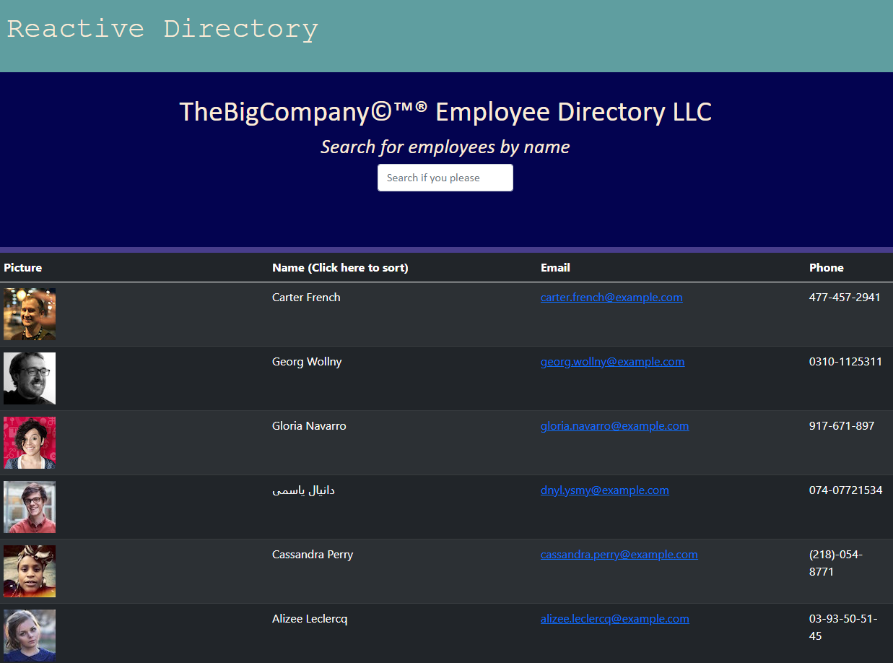

# React Employee Directory

## Description
This [web application](https://prophetrand.github.io/react-employee-directory/) deployed on GitHub Pages is a scalable employee directory engine that display's non-sensitive information for all of a company's or department's employees. The user or manager viewing the page can filter the list of employees by name using the central search field, and can also sort employees by name alphabetically or in reverse. This succinct application utilizes React components and hooks to render its contents dynamically.


## Table of Contents
* [Technologies Used](#technologies-used)
* [How to Access](#how-to-access)
* [What I Did](#what-i-did)
* [Code Snippets](#code-snippets)
* [Screenshots](#screenshots)
* [Acknowledgments](#acknowledgments*)
* [Who I Am](#who-i-am)

---

## Technologies Used
* [React](https://reactjs.org/) for building a dynamic, component-based UI for this webpage using JavaScript and JSX.
* [Javascript](https://www.javascript.com/) to develop the logic and dynamically-generated HTML included in this web application.
* [Git](https://git-scm.com/) for distributed version control, tracking changes over time and making them visible to collaborators.
* [Github](https://github.com/) for version control in the cloud, saving my changes and presenting them clearly to myself and others.

## How to Access
This web application is available on most browsers and is hosted on GitHub Pages. The site can be [accessed here](https://prophetrand.github.io/react-employee-directory/), and here: <https://prophetrand.github.io/react-employee-directory/>

---

## What I Did
Utilizing React's hooks of useState and useEffect, I wrote the logic for this web app in the functional components App, Header, Table, and TableRow. I passed functions defined in `App.js` as props to the necessary components that render downstream of the return statement in App, allowing those descendants to manipulate the stateful variables of App as well. 

## Code Snippets 
In the snippet below, I first defined a set of stateful variables with the `useState` hook. The first variable name within each destructured array *(e.g. work)* represents the state "getter" that I use to read from the current state, and the second variable *(e.g. setWork)* represents the state "setter" that allows me to update the state. The values passed to each useState hook represent the initial/default value of the state. The next hook `useEffect` calls the callback function in its first argument when the component first mounts, meaning when React first renders the component to the DOM. Its second argument here is an empty array, but including variables in that array would inform the hook to execute the callback function whenever those particular variables change.

In the functions that follow, I call setWork and setFilter after specifying some data for them to update their respective stateful variables with. The default stateful values are overwritten as a result.

```javascript
const [work, setWork] = useState([]);
const [filter, setFilter] = useState("");
const [sort, setSort] = useState("");
const [symbol, setSymbol]= useState('(Click here to sort)');

useEffect(() => {
    loadCompany();
}, []);

function loadCompany() {
    API.populateCompany().then((res) => {
        setWork(res);
    }).catch(err => console.log(err));
}

const filterTime = e => {
    const { value } = e.target;
    setFilter(value);
}
```

## Screenshots
Example of the web application before any search filter or name sorting are applied:


---

## Acknowledgments
* [Random User Generator](https://randomuser.me/) is a free API that I used to generate a fictional employee roster. It provides a robust list of employee data in JSON format and is incredibly useful for doing just that in an easily accesible way.
* [W3Schools](https://www.w3schools.com/) has been my go-to for descriptive tutorials on HTML, CSS, and Javascript syntax and best practices. I am eternally grateful for their massive store of documentation.
* [MDN Web Docs](https://developer.mozilla.org/en-US/) is another resource for documentation on HTML, CSS, and Javascript that I find myself using more and more often as I work through deeper Javascript.

## Who I Am
My name is Rand Hale, and I am an aspiring programmer/web developer based in California.

* [LinkedIn](https://www.linkedin.com/in/rand-hale-83ba389b/)
* [GitHub](https://github.com/prophetrand)